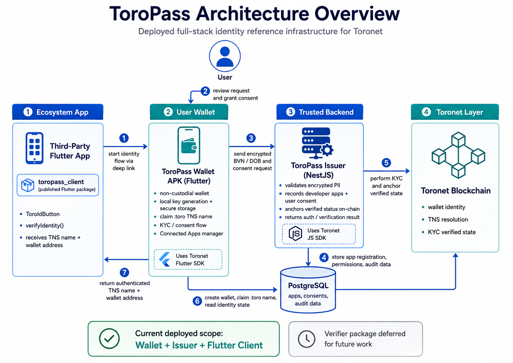

# 📝 ToroPass

ToroPass is a deployed full-stack Toronet identity reference project: a production-grade wallet, issuer backend, and Flutter client package that together provide a reusable "Sign in with ToroPass" identity flow for the Toronet ecosystem.

## 🌟 Project Overview

ToroPass is a hybrid decentralized identity and Identity-as-a-Service reference implementation built for Toronet.

At a high level, ToroPass gives the ecosystem:
- a mobile wallet where users can create or validate a Toro identity
- a secure KYC and consent flow anchored to Toronet
- a Flutter client package that third-party Flutter developers can drop into their own apps
- a backend issuer service that acts as the trusted identity authority for the flow

The project is deeply integrated with the Toronet ecosystem because Toronet wallet identity, TNS names, and Toronet-based verification are central to the user and developer experience. ToroPass is not a generic OAuth demo with Toronet branding added later. The product depends on Toronet SDK integration at its core:
- the wallet experience depends on the Issuer backend
- the issuer backend depends on the Toronet JS/TS SDK
- the system’s core value proposition is Toronet-native identity verification for ecosystem apps

The motivation for building ToroPass is simple: Toronet developers should not have to rebuild identity and KYC pipelines from scratch for every new application. That work is repetitive, risky, and slows ecosystem adoption. ToroPass aims to become a trustworthy reference implementation that future Toronet developers can study, integrate, and extend.

This project is especially relevant because the deployed reference stack is already usable by Flutter developers today:
- the ToroPass Wallet APK is published through GitHub Releases
- the Flutter client package is published and can be integrated in third-party apps
- the identity approval and callback flow works end to end with the deployed stack

**Optional demo / pitch video:** To be attached in the application PR or follow-up comment.

---

## 🔍 Project Details

### Technology Stack

- **Mobile wallet:** Flutter
- **Wallet-side state management:** Riverpod
- **Wallet authentication and storage:** `local_auth`, `flutter_secure_storage`, `shared_preferences`
- **Deep linking and app-to-app handoff:** `go_router`, native Android/iOS deep links
- **Third-party Flutter integration package:** `toropass_client`
- **Issuer backend:** NestJS / TypeScript
- **Backend data store:** PostgreSQL with Prisma
- **Monorepo tooling:** Melos for Dart packages, pnpm for Node packages

### Core Architecture

ToroPass currently consists of three delivered components and one planned future component:

1. **ToroPass Wallet (`apps/toropass_wallet`)**
   - non-custodial Flutter mobile application
   - allows users to create or validate a Toro wallet identity
   - handles KYC input, biometric protection, and OAuth consent approval
   - includes connected app management and an OAuth developer dashboard

2. **ToroPass Issuer (`backend/toropass_issuer`)**
   - secure NestJS issuer backend
   - processes wallet validation, token refresh, KYC verification, and OAuth authorization
   - stores app registrations and user consent state
   - anchors KYC verification to Toronet through Toronet SDK integration

3. **ToroPass Client (`packages/toropass_client`)**
   - published Flutter package for third-party Flutter developers
   - launches ToroPass Wallet
   - captures callback results
   - exchanges authorization codes and fetches approved profile data

4. **ToroPass Verifier (`packages/toropass_verifier`)**
   - planned future work
   - intended as a backend-side verifier package for Node.js ecosystem services
   - not part of the currently completed deliverable

### Core Flow

1. User installs ToroPass Wallet.
2. User creates or validates a Toro identity.
3. User completes KYC in ToroPass Wallet.
4. A third-party Flutter app integrates `toropass_client`.
5. The third-party app launches ToroPass Wallet for consent.
6. User approves or denies the request.
7. The client app receives the callback and fetches the approved identity result.

### Existing Implementation Status

ToroPass is already substantially implemented:
- the wallet app exists and has been prepared for Android release distribution
- biometric protection is implemented
- KYC onboarding flow is implemented
- OAuth consent and callback flow is implemented
- the client package has been published and tested in an example app
- the root project documentation has been written to emphasize real usage of the deployed reference rather than local full-stack cloning

### Relevant Documentation / Prior Work

- Monorepo source code: `https://github.com/maverick0x/toropass`
- ToroPass root README: explains the deployed reference posture
- `packages/toropass_client/README.md`: integration instructions for Flutter developers
- `packages/toropass_client/example/README.md`: runnable example integration app
- `context/project.md`: architecture overview

### Core APIs / Data / Protocol Surface

The core system implements:
- wallet username / TNS validation
- wallet creation and validation
- token refresh
- KYC verification submission
- OAuth app registration
- OAuth authorization and callback handling
- approved profile fetch for third-party apps
- consent revocation

### What This Project Will Not Provide or Implement

ToroPass in its current bounty scope does **not** provide:
- a generic web dashboard for non-Flutter frontend integrations
- a completed Node verifier package for third-party backends
- a local development setup that mirrors the private production issuer environment without additional secrets and infrastructure
- a zero-knowledge proof or verifiable credential system yet

This is intentional. The current delivery focuses on a working, production-style Flutter-first identity reference flow.

---

## 🧩 Ecosystem Fit

### Where and how does your project fit into the Toronet ecosystem?

ToroPass fits into the Toronet ecosystem as identity infrastructure.

It sits between:
- **users**, who need a secure way to prove identity once
- **Flutter app developers**, who want an easy integration path
- **issuer infrastructure**, which manages verification and consent

It is best understood as the Toronet equivalent of a reusable identity layer for mobile applications.

### Who is your target audience?

Primary audiences:
- Flutter developers building on Toronet
- users who need a Toronet-native identity wallet
- ecosystem builders who need a reference for Toronet SDK usage across mobile and backend systems

Secondary audiences:
- reviewers and ecosystem maintainers looking for a production-grade example
- future contributors who want to extend ToroPass

### What problem(s) does your project solve?

ToroPass solves several ecosystem problems:
- repeated KYC implementation effort across apps
- inconsistent consent and identity UX across Toronet apps
- lack of a definitive full-stack reference for Toronet SDK usage
- high integration friction for Flutter developers building real applications
- user privacy risk from uploading sensitive identity data separately to multiple apps

### Are there existing projects similar to yours within the Toronet ecosystem?

To my knowledge, there is no equivalent Toronet-first delivered reference that combines:
- a real mobile holder wallet
- an issuer backend
- a published Flutter client package
- an end-to-end consent-based identity handoff flow

If there are related identity or onboarding efforts, ToroPass is differentiated by being:
- Flutter-first for ecosystem adoption
- full-stack rather than isolated to one layer
- designed as a reusable reference artifact, not just a product demo
- already deployable and testable through published assets

---

# 👥 Team

- **Team Name:** ToroPass
- **Contact Name:** `ToroPass`
- **Contact Email:** `faroukk.bello@gmail.com`
- **Website:** `https://github.com/maverick0x`,

_NB: website will be deployed to `https://toropass.app` soon. Health check is available at **`https://api.toropass.app/api`**_

---

## Team Members

Please replace this section with the legal names of all contributors or beneficiaries.

- `Farouk Bello`

### LinkedIn Profiles (if available)

- `https://www.linkedin.com/in/faroukk-bello`

---

## Team Code Repositories

- `https://github.com/maverick0x/toropass`

Please also provide the GitHub accounts of all team members:

- `https://github.com/maverick0x`

---

## Team Experience

The project demonstrates experience across:
- Flutter application architecture
- mobile deep linking and app-to-app authentication flows
- secure mobile storage and biometric protection
- OAuth-style consent systems
- NestJS backend architecture
- production-style error handling and documentation
- package design for third-party developer reuse

Relevant technical strengths shown in the work include:
- blockchain-integrated product design
- developer tooling and SDK consumption patterns
- full-stack architecture across mobile and backend boundaries
- reusable package creation and publication
- documentation intended for ecosystem learning and onboarding

---

# 📊 Development Status

Development has already started and the project is substantially implemented.

### Repository Links

- Main monorepo: `https://github.com/maverick0x/toropass`

### Current Implementation Status

Implemented:
- ToroPass Wallet onboarding and identity flow
- KYC input and verification flow
- OAuth consent approval screen
- connected app management
- biometric protection
- Flutter client package for third-party apps
- example Flutter integration app
- Android release packaging for the wallet

Planned but not yet completed:
- `toropass_verifier` backend verifier package

### Screenshots / Demos

To be attached in the application PR or follow-up discussion:
- wallet onboarding screenshots
- KYC flow screenshots
- consent flow screenshots
- example client integration screenshots
- demo video link

---

# 📅 Development Roadmap

The project is already in an advanced implementation state. The roadmap below is structured so reviewers can verify the work as a sequence of concrete deliverables.

## Overview

- **Estimated Duration:** 4 weeks total for reference completion, documentation polishing, review support, and remaining submission artifacts
- **Full-Time Equivalent (FTE):** 1 FTE

| Number | Deliverable | Specification |
| -----: | ----------- | ------------- |
| 0a. | License | Add or confirm an open-source license for the project repository before final bounty closeout |
| 0b. | Documentation | Available at [ToroPass Docs](https://github.com/maverick0x/toropass/blob/main/README.md) |
| 0c. | Testing and Testing Guide | Available at [ToroPass Docs](https://github.com/maverick0x/toropass/blob/main/README.md) |
| 1. | ToroPass Wallet Reference Delivery | Deliver the mobile wallet with onboarding, KYC, consent management, biometric protection, and Android release packaging |
| 2. | ToroPass Client Package Delivery | Deliver the published Flutter package, example app, callback handling, authorization flow, and profile retrieval path |
| 3. | Issuer Backend Reference Delivery | Deliver the secure issuer backend reference implementation with wallet, token, KYC, and OAuth consent endpoints plus backend documentation |

### Milestone 1: Wallet Reference

**Functionality delivered**
- ToroPass Wallet mobile UX
- identity creation / validation flow
- settings, biometric lock, consent safety dialogs
- Android release APK

**How reviewers can verify**
- install the APK
- create or validate a Toro identity
- enable biometrics
- test logout, change password, and connected app management

**Technical expectation**
- stable wallet UX
- meaningful Toronet SDK integration
- production-style error handling

### Milestone 2: Flutter Client Package

**Functionality delivered**
- `toropass_client` package
- example Flutter integration app
- deep-link launch and callback handling
- code exchange and profile fetch

**How reviewers can verify**
- inspect published package docs
- run the example app
- trigger an end-to-end consent flow against ToroPass Wallet

**Technical expectation**
- low-friction API surface for ecosystem Flutter developers
- documented deep-link setup
- reusable integration pattern

### Milestone 3: Issuer Backend Reference

**Functionality delivered**
- NestJS issuer backend
- wallet validation endpoints
- KYC verification processing
- OAuth app registration and consent handling

**How reviewers can verify**
- inspect backend architecture and documentation
- review endpoint documentation
- validate that the wallet and client integration depend on this backend reference

**Technical expectation**
- environment-variable-based secret handling
- strong separation of concerns
- production-style architecture and documentation

---

# 🔮 Future Plans

After the bounty, I plan to continue developing ToroPass in three directions:

1. **Backend verifier package**
   - complete the planned `toropass_verifier` package for Node.js ecosystem backends

2. **Identity capability expansion**
   - move beyond basic KYC status into broader reusable credentials and permissioned identity claims
   - Enable developers to trigger the verification flow from their app (if the wallet is not verified).

3. **Ecosystem adoption**
   - improve onboarding and documentation for Flutter developers
   - support more production examples and integration guides
   - explore partnerships with Toronet applications that need identity, onboarding, or compliance-aware flows

Long-term, ToroPass can become a foundational identity primitive in the Toronet ecosystem: not just a single app, but a reusable identity layer and reference implementation for many applications.

---

# ℹ️ Additional Information

- ToroPass is intentionally positioned as a **deployed reference experience**, not only a source repository
- the published client package and released wallet APK are central to the submission’s practical value
- the project is especially useful as an onboarding and reference artifact for Flutter developers in the Toronet ecosystem
- a full local production-equivalent clone is possible in principle, but not the recommended first experience for reviewers because private infrastructure and secrets are intentionally not included
- this positioning is deliberate: the project is meant to be usable today while still serving as a trustworthy source reference for future builders

Potential PR follow-up attachments:
- demo video link